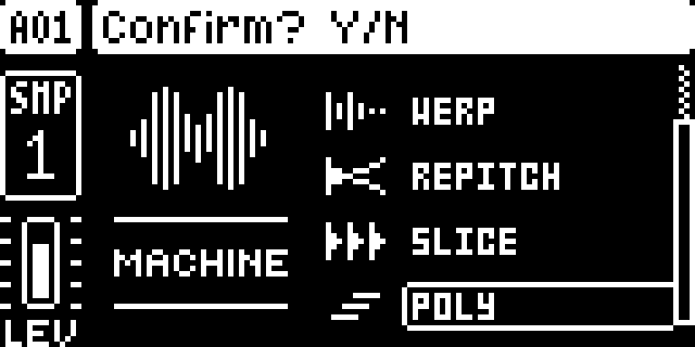
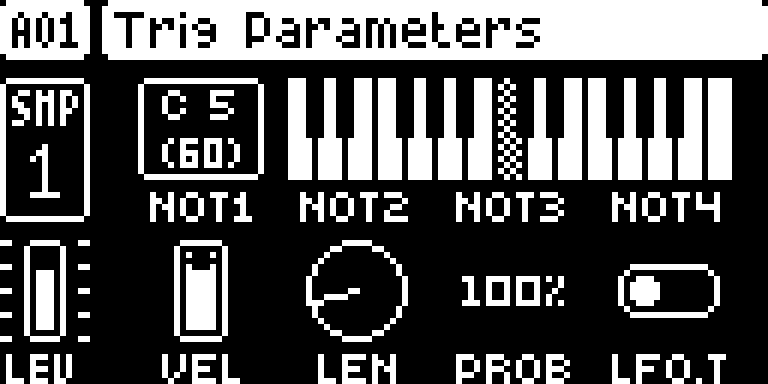

# digichain

Modwerk metadata version: `1.6.1-experimental`.

## Overview

digichain is a framework other mods build on. SOPHIE, NEIGHBOR and DIGISLICER each patch some of the same SRC-page places (knob labels, values, graphics and ranges) and the same render step, and elekloader allows one owner per byte. digichain owns each of those places once and passes each call to the mod whose machine it is for, or to the stock code. Digi Mono and Digi Poly get their SRC page through it too, Digi Mono its LFO page’s DEST names as well, and the FUNC + SRC list draws every added machine’s icon. The author’s description also covers the -chain builds of SOPHIE, NEIGHBOR and DIGISLICER that the author’s own tools make for it; Modwerk carries those mods as their authors built them, and its builder refuses them beside digichain. It adds no sound, page or control, and changes nothing on its own.

## Controls

digichain adds no controls of its own. The knobs on a Digi Mono or POLY track’s SRC page belong to those mods; digichain only passes their calls on.

With the author’s -chain build of NEIGHBOR, digichain also limits NEIGHBOR’s SLOT (knob E) to 0–8, and when a track has been NEIGHBOR for half a second with SLOT at 0, it sets SLOT to the track on its left (track 2 for track 1). Modwerk’s builder does not accept NEIGHBOR beside digichain, so this does not apply to a Modwerk build.

## Usage

Use the access steps below after installing a compatible build. The tutorial gives a first practical pass through the module.

### Where to find it

No page of its own; it works behind the SRC pages, the LFO page and the FUNC + SRC machine list

1. Build digichain with Digi Mono or Digi Poly, which require it; on its own it changes nothing.
2. On an audio track, press FUNC + SRC: every added machine shows its own icon in the list.
3. Choose a Digi Mono machine or POLY: its SRC page, and for Digi Mono its LFO page’s DEST names, come through digichain.

### Quick tutorial: use a dependent machine

1. Build digichain together with Digi Poly, which requires it, for a supported original Digitakt OS.
2. On an audio track press FUNC + SRC, select POLY, confirm with YES.
3. On TRIG set NOT1, then add NOT2 at +4 and NOT3 at +7. Trigger the track to hear the chord using the available voice pool.
4. Stop playback. Return the track to ONESHOT to stop using POLY; digichain has no independent page or bypass control.

## Compatibility and limitations

- digichain needs core 2.1 and requires no other mod.
- Digi Mono and Digi Poly require digichain.
- Modwerk’s builder refuses it beside NEIGHBOR, DIGISLICER and SOPHIE, because their patch sites overlap. The author’s -chain builds of those three, which route through digichain, are not in Modwerk.
- elekloader’s check decides at build time.

- Modwerk’s builder refuses digichain beside NEIGHBOR, DIGISLICER and SOPHIE: elekloader finds that their patch sites overlap. The -chain builds of those three, which the author’s tools/dev.sh makes to route through digichain, are not in Modwerk.
- Built for Digitakt OS 1.53 and 1.54.
- It changes nothing on its own: it routes calls for the mods that build on it, in Modwerk Digi Mono and Digi Poly.
- Its NEIGHBOR behaviour (SLOT limited to 0–8, a new NEIGHBOR track taking the track on its left as its source) needs NEIGHBOR in the build, so it does not apply to a Modwerk build.
- Not yet tested on a unit, its author reports; it passes the author’s emulator tests on OS 1.53 and 1.54.

## Tests and measurements

See [TESTING.md](TESTING.md) for the documentation capture run and the separate pinned author evidence. UI captures do not qualify audio, timing, stress behaviour, persistence or hardware. Imported object memory estimates remain separate from measured runtime cost.

## Authorship and licences

- gdeo607 — digichain design and code

The source is pinned to [35bacb3730d108e4dc48a7bd6de4c99ae9b161e6](https://github.com/gdeo607/digi1_mods/tree/35bacb3730d108e4dc48a7bd6de4c99ae9b161e6). The full MIT licence is in [LICENSE](LICENSE). Capture rights are declared separately in [media/LICENSE.md](media/LICENSE.md).

## Screens and audio

These captures show the dependent POLY machine in a digichain + Digi Poly build; digichain has no independent page. Real firmware-rendered emulator captures on OS 1.53. The [capture record](media/capture.json) includes source/build identities, panel inputs, timestamps and PNG hashes. [Capture rights](media/LICENSE.md) preserve the underlying interface rights. The [thumbnail](media/thumbnail.svg) is an illustration. No audio demonstration is claimed.

Dependent POLY machine supplied through digichain.

POLY consumer controls; digichain has no page of its own.
