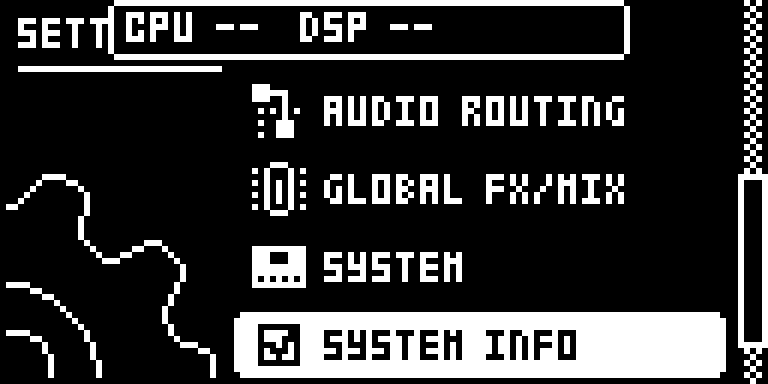
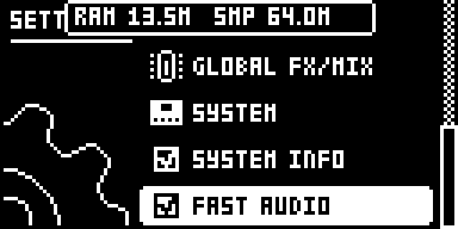
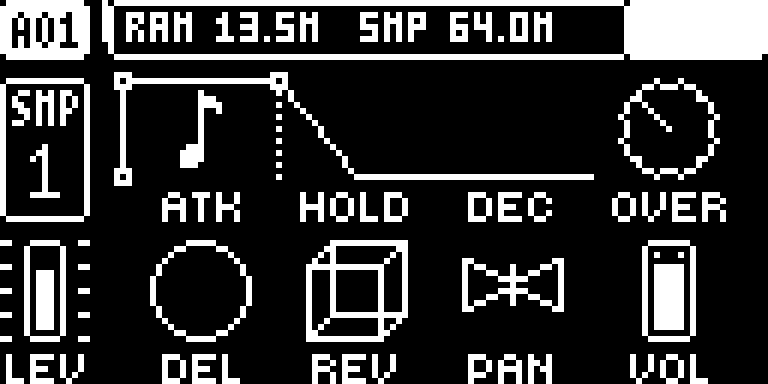
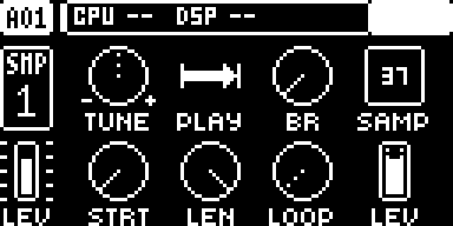

# digihealth — Digitakt

Modwerk documentation version: `1.0.2-experimental`. This editorial update adds the guide, LCD captures and frontend descriptions; the pinned native source, build recipe and existing test evidence are unchanged.

## Overview

digihealth adds FAST AUDIO and SYSTEM INFO to SETTINGS on the original Digitakt. FAST AUDIO runs the audio renderer’s existing hot code from on-chip SRAM; it changes where the code runs, rather than the sound. It normally starts about two seconds after the screen appears. SYSTEM INFO alternates CPU/audio-render load and free RAM/sample memory in the top bar. Its DSP figure describes the audio render, not the cost of a single module. A read-only USB SysEx diagnostics channel uses device byte 0x7D.

- FAST AUDIO uses the existing render code in SRAM, with a checksum watchdog and fallback to stock code.
- SYSTEM INFO alternates load and memory pages every two seconds, including the last second’s DSP peak.
- The optional USB diagnostics channel reads status without changing settings or memory.

## Controls

| Control | What it does |
| --- | --- |
| FAST AUDIO | Runs the existing audio-render code from SRAM. Normally starts about two seconds after boot; unticking disables it until the next power-on. It refuses a nonempty SRAM area, and its checksum watchdog returns to stock code if the copy is overwritten. |
| SYSTEM INFO | Shows alternating two-second top-bar pages: CPU load and audio-render DSP current/last-second peak, then free heap RAM and sample memory. Untick to hide the display; these are whole-workload readings, not a per-module benchmark. |

The manifest leaves numeric defaults unspecified. The tutorial below gives example settings, not a new set of factory defaults.

## Usage

Use the access steps below after installing a compatible build. The tutorial gives a first practical pass through the module.

### Where to find it

Location: SETTINGS.

1. Use a build containing digihealth for the original Digitakt on OS 1.53 or 1.54.
2. Open SETTINGS and tick SYSTEM INFO to show the readout in the top bar.
3. FAST AUDIO normally starts automatically after boot; untick its SETTINGS row to disable it for this power-on.

These instructions assume the module is already installed in a compatible build. For selecting and building it in Modwerk, see the [Digitakt guide](../../../machines/digitakt/README.md).

### Quick tutorial: compare a pattern’s render load

1. Open SETTINGS, tick SYSTEM INFO, then return to a pattern with samples already loaded.
2. Play the pattern. Watch CPU and DSP current/peak load, then wait for the free RAM and sample-memory page; the pages alternate every two seconds.
3. Keep the pattern unchanged and untick FAST AUDIO in SETTINGS. Compare several readouts of the same passage; any difference depends on the workload.
4. Stop playback and untick SYSTEM INFO to hide the readout. FAST AUDIO stays disabled until the next power-on; its watchdog may also refuse or undo the SRAM copy.

The readout is useful when adding heavier machines such as SOPHIE. Compare the same pattern and settings over several updates; a single peak does not establish a safe maximum track count. FAST AUDIO’s automatic startup and watchdog are described in the pinned author guide. No numeric boot default is declared in the Modwerk manifest.

### Optional USB diagnostics

The pinned author guide describes HELLO, STATS and PEEK, read-only SysEx commands on device byte `0x7D`. Its `tools/digiusb.py` is an upstream Windows tool, not bundled in this module folder. Close Elektron Transfer before using that tool: Windows allows one application at a time to open the MIDI port. The panel readout needs no desktop tool.

## Compatibility and limitations

- Original Digitakt (Mk1), OS 1.53 or 1.54; this is not a Digitakt II module.
- FAST AUDIO’s automatic attempt happens once after boot. Disabling it is not saved across power cycles; it can refuse occupied SRAM or fall back after a failed checksum.
- The stock-dependent copy and fixups are derived from the owner’s verified OS during the local build. See the [source-build workflow](../../../../docs/ELEMOD_SOURCE_BUILDS.md).
- SYSTEM INFO’s DSP figure is the complete audio renderer’s load. The author’s historical timing comparison does not measure this Modwerk revision or every configuration.

## Tests and measurements

The Modwerk evidence tier remains `none`. [TESTING.md](TESTING.md) records the UI capture run, exact source/build identities and the separate imported author evidence. The captures do not qualify audio, timing, persistence or hardware.

The imported release-object memory estimate is **5,672 B**, excluding the shared core and linker alignment. Modwerk CPU/audio load remains unmeasured. Upstream results in the [pinned author guide](upstream/README.md) describe the author's builds and are separate from this revision's evidence.

## Authorship and licences

- irpina — digihealth design and code

The module is licensed under [GPL-2.0-or-later](LICENSE). Imported source: [irpina/digihealth at `6d2a95605901`](https://github.com/irpina/digihealth/tree/6d2a95605901f4f5ea6301dbad16e573380331a6). The source pin and upstream notices are retained. More detail is in [upstream/README.md](upstream/README.md).

## Screens and audio

Real firmware-rendered emulator captures on OS 1.53. The [capture record](media/capture.json) includes source/build identities, panel inputs, timestamps and PNG hashes. [Capture rights](media/LICENSE.md) preserve the underlying interface rights. The [thumbnail](media/thumbnail.svg) is an illustration. No audio demonstration is claimed.

SYS INFO in Settings.

FAST AUDIO setting with the memory overlay.

Load overlay on AMP; timing counters unavailable.

Load overlay on SRC; timing counters unavailable.
