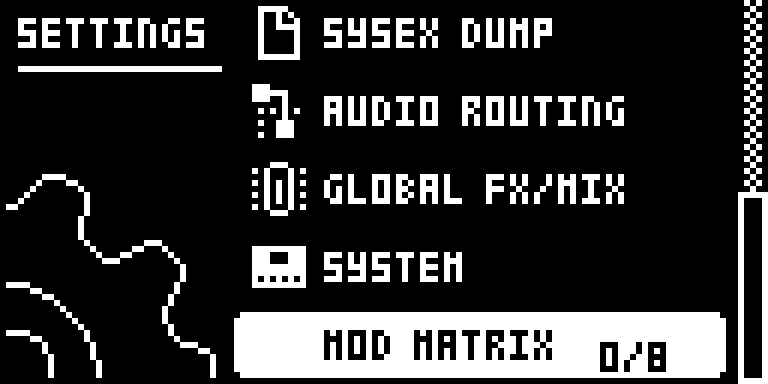
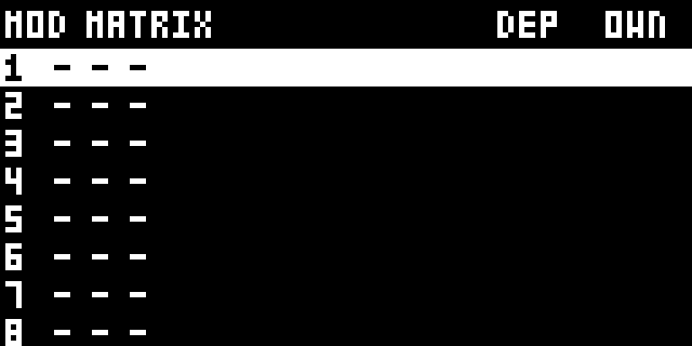
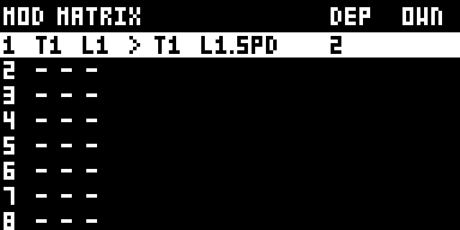

# Digi Matrix

Modwerk metadata version: `1.0.1-experimental`.

## Overview

Digi Matrix is a modulation matrix for the LFOs of the original Digitakt. Stock, each of a track’s two LFOs modulates one parameter of its own track. SETTINGS > MOD MATRIX adds a page of 8 routing slots; each sends any track’s LFO1 or LFO2 to any parameter of any track, with its own depth from -64 to +64, so one LFO can drive several parameters across several tracks by different amounts. Per slot, OWN says whether the LFO still modulates its own track’s DEST as well. The matrix lives in the pattern’s kit, so each pattern has its own and it is saved with the project.

## Controls

From the author’s [docs/USAGE.md](https://github.com/gdeo607/digi1_mods/blob/35bacb3730d108e4dc48a7bd6de4c99ae9b161e6/docs/USAGE.md).

| Control | What it does |
| --- | --- |
| UP / DOWN or LEVEL | Choose one of the 8 slots; the slot under the cursor is shown inverted. |
| YES | Turn the slot under the cursor on, or off again. A slot switched on for the first time starts on the cursor’s own track: slot 3 routes track 3’s LFO1 to track 3. The knobs edit only a slot that is on. |
| NO | Leave the MOD MATRIX page. |
| Knob A | Source track, 1–8. |
| Knob B | Source LFO, 1 or 2 (L1 or L2 on the page). |
| Knob C | Destination track, 1–8. |
| Knob D | Destination parameter, named by its page: SRC.A to SRC.H (the track’s SRC page, whatever its machine calls them); FLT.TYPE, FREQ, RESO, ENV, ATK, DEC, SUS and REL; FLT2.A to FLT2.E (the second filter page); AMP.ATK, HOLD, DEC, OVER, DEL, REV, PAN and VOL; and L1.\* and L2.\*, so an LFO can modulate the other one’s speed, depth and so on. |
| Knob E | Depth, -64 to +64, 2 a notch. Each slot has its own depth, independent of the source LFO’s own DEP, which keeps controlling only its own track’s modulation. |
| Knob F | OWN: whether the source LFO still modulates its own track’s DEST as well (blank), or only what the matrix routes it to (X). |

The source LFO runs as it always did: its SPD, MULT, WAVE, PHAS, FADE and trig MODE are on its own track’s LFO page.

## Usage

Use the access steps below after installing a compatible build. The tutorial gives a first practical pass through the module.

### Where to find it

SETTINGS > MOD MATRIX

1. Open SETTINGS and go to the MOD MATRIX row; it shows how many of the 8 slots are on.
2. Press YES on the row to open the page of 8 routing slots.
3. Choose a slot with UP/DOWN or the LEVEL knob and press YES to turn it on.
4. Set the slot with knobs A–F; NO leaves the page.

### Quick tutorial: route an LFO to another track

1. Use a build containing Digi Matrix and a pattern with a sounding sample on T4. Set T1’s LFO1 to a slow wave on its normal LFO page.
2. Open SETTINGS > MOD MATRIX, press YES to enter, select the first slot and press YES to enable it.
3. Set A to source T1, B to L1, C to destination T4, D to FLT.FREQ and E to a positive depth. Play the pattern and hear T4’s filter move.
4. Press YES on the routing slot to turn it off, press NO to leave the matrix, and stop playback.

## Compatibility and limitations

Digi Matrix needs core 2.1 and no other mod. Modwerk’s builder refuses no mod beside it: in elekloader’s check it combines with every other Modwerk mod for its OS, NEIGHBOR, DIGISLICER and SOPHIE included (SOPHIE is built for OS 1.53 only). elekloader’s check decides at build time.

- Modwerk’s builder refuses no mod beside it: in elekloader’s check it combines with every other Modwerk mod for its OS, NEIGHBOR, DIGISLICER and SOPHIE included (SOPHIE is built for OS 1.53 only).
- Built for OS 1.53 and 1.54.
- SRC.A to SRC.H follow whatever the destination track’s machine puts on those knobs; the page names them by page and knob, so the author advises picking them with that track’s SRC page in front of you.
- A trig-mode source LFO moves only when its own track trigs.
- The matrix is kept in six bytes of each sound record that the firmware saves and loads but does not use itself; the author asks owners to check once, after a power cycle on a unit, that a pattern’s matrix came back.
- Not yet tested on a unit, its author reports; it passes their emulator tests on OS 1.53 and 1.54.

## Tests and measurements

See [TESTING.md](TESTING.md) for the documentation capture run and the separate pinned author evidence. UI captures do not qualify audio, timing, stress behaviour, persistence or hardware. Imported object memory estimates remain separate from measured runtime cost.

## Authorship and licences

- gdeo607 — Digi Matrix design and code (digi1_mods)

The source is pinned to [35bacb3730d108e4dc48a7bd6de4c99ae9b161e6](https://github.com/gdeo607/digi1_mods/tree/35bacb3730d108e4dc48a7bd6de4c99ae9b161e6). The full MIT licence is in [LICENSE](LICENSE). Capture rights are declared separately in [media/LICENSE.md](media/LICENSE.md).

## Screens and audio

Real firmware-rendered emulator captures on OS 1.53. The [capture record](media/capture.json) includes source/build identities, panel inputs, timestamps and PNG hashes. [Capture rights](media/LICENSE.md) preserve the underlying interface rights. The [thumbnail](media/thumbnail.svg) is an illustration. No audio demonstration is claimed.

MOD MATRIX in Settings.

Eight matrix slots, initially disabled.

Enabled T1 LFO1 route and its depth.
