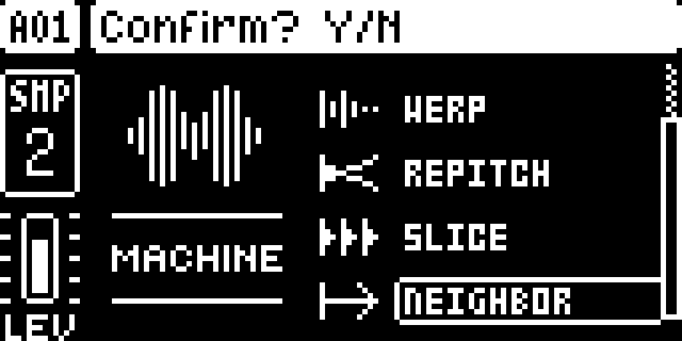
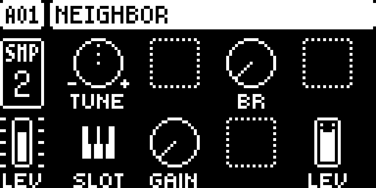
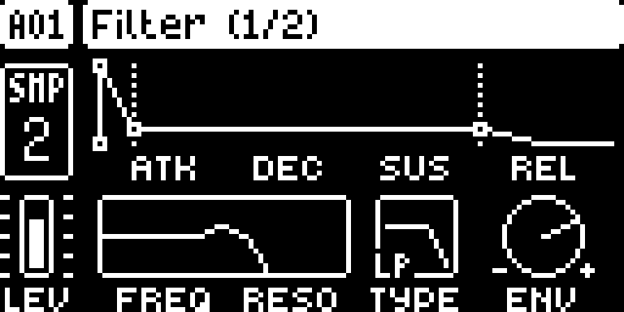
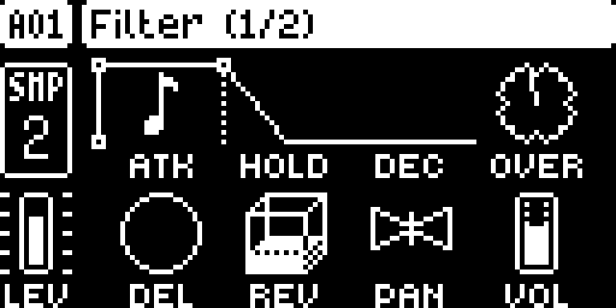

# NEIGHBOR — Digitakt

Modwerk documentation version: `0.6.1-experimental`. This editorial update adds the guide, LCD captures and frontend descriptions; the pinned native source, build recipe and existing test evidence are unchanged.

## Overview

NEIGHBOR replaces a sample source with another audio track’s post-filter signal on the original Digitakt. Choose the receiving track with FUNC + SRC, set SLOT to the source track, and trigger the receiving track so its AMP envelope opens. The incoming signal passes through the receiving track’s overdrive, bit reduction, filter, envelope, volume, pan and sends. The source is tapped before its volume, so lowering the source’s AMP VOL removes the dry mix without cutting the routed signal. Routing adds one 32-sample block (about 0.67 ms); nonzero pitch shifting adds further latency. This remains an upstream prototype.

- SLOT selects source track 1–8; zero or the receiving track itself produces silence.
- TUNE shifts up to two octaves either way and follows trig notes; neutral pitch bypasses the shifter.
- LEV drives the receiving chain; GAIN adds up to +31.5 dB after that chain and before its volume.
- Receiving-track trigs and AMP settings gate the source; the original track can remain in the dry mix.

## Controls

| Control | What it does |
| --- | --- |
| TUNE | SRC knob A: pitch shift from -24 to +24 semitones, also transposed by the receiving trig’s note. At 0.00 with no note transpose the shifter is bypassed. Nonzero shifting adds approximately 3–27 ms beyond the routing delay. |
| BR | SRC knob C: stock-style bit reduction applied to the routed signal in the receiving track’s chain. |
| SLOT | SRC knob E: source audio track 1–8. Zero or this receiving track’s own number produces silence. The source is tapped after its filter and before its volume. |
| GAIN | SRC knob F: amplification from 0 to +31.5 dB in 0.5 dB steps after the receiving chain and before its volume. Clips at full scale. Unlike LEV, it does not increase drive into the receiving overdrive. |
| LEV | SRC knob H: level entering the receiving chain, scaled by trig velocity. LEV 100 with velocity 100 passes the source at its own level before the receiving processing; higher values drive its overdrive harder. |

The manifest leaves numeric defaults unspecified. The tutorial below gives example settings, not a new set of factory defaults.

## Usage

Use the access steps below after installing a compatible build. The tutorial gives a first practical pass through the module.

### Where to find it

Location: SRC machine list.

1. Use a build containing NEIGHBOR for the original Digitakt on OS 1.53 or 1.54, and load a sample on the source track.
2. Select a different audio track, press FUNC + SRC, scroll below SLICE to NEIGHBOR, and confirm with YES.
3. On the receiving track’s SRC page set SLOT (knob E) to the source track number, then add a receiving-track trig.

These instructions assume the module is already installed in a compatible build. For selecting and building it in Modwerk, see the [Digitakt guide](../../../machines/digitakt/README.md).

### Quick tutorial: filter a drum track through T2

1. Put a drum sample and a few trigs on T1. On T2 choose NEIGHBOR with FUNC + SRC, then set SLOT to 1.
2. Set T2 TUNE to 0 with no trig-note transpose, GAIN to 0 dB and LEV to 100. Add a T2 trig and use a long AMP HOLD or DECAY so its envelope lets T1 through.
3. Play the pattern and adjust T2’s filter or delay send. Lower T1’s AMP VOL to hear only T2’s processed signal; the source tap is before T1’s volume.
4. Try T2 TUNE at +12 semitones, or lock T2’s trig notes, to pitch-shift the routed audio. The shifter adds latency beyond the routing block.
5. Stop playback, restore T1’s AMP VOL and set T2 SLOT to 0 to silence the route. Return T2 TUNE to 0 and GAIN to 0 dB for a neutral starting point.

All five SRC controls are stored with the kit and accept parameter locks and LFOs. The receiving voice must be triggered: SLOT alone does not open its envelope. If the result is quiet, open its filter, lengthen its AMP envelope and check both track volumes before adding GAIN. PLAY, SAMP and GRID are inactive on the trimmed NEIGHBOR page.

## Compatibility and limitations

- Original Digitakt (Mk1), OS 1.53 or 1.54, with core 2.1 or later for the added machine slot.
- A prototype. The author reports routing on hardware; later TUNE/GAIN/LEV and machine-slot revisions have emulator evidence only in the pinned guide.
- Each routing hop adds 32 samples (about 0.67 ms). With pitch shifting enabled, the author describes another 3–27 ms of delay, approximately 13 ms on average.
- SLOT 0 and self-routing are silent. The source’s filtering and envelope still affect what the receiving track gets; the receiving chain processes that signal again.
- The author expects a NEIGHBOR track to be silent on stock firmware, but marks that fallback untested. Preserve a backup rather than relying on it.

## Tests and measurements

The Modwerk evidence tier remains `none`. [TESTING.md](TESTING.md) records the UI capture run, exact source/build identities and the separate imported author evidence. The captures do not qualify audio, timing, persistence or hardware.

The imported release-object memory estimate is **26,712 B**, excluding the shared core and linker alignment. Modwerk CPU/audio load remains unmeasured. Upstream results in the [pinned author guide](upstream/README.md) describe the author's builds and are separate from this revision's evidence.

## Authorship and licences

- irpina — NEIGHBOR design and code

The module is licensed under [GPL-2.0-or-later](LICENSE). Imported source: [irpina/digineighbor at `d09574ab5fac`](https://github.com/irpina/digineighbor/tree/d09574ab5fac8c079849e74c5c3efe129de54126). The source pin and upstream notices are retained. More detail is in [upstream/README.md](upstream/README.md).

## Screens and audio

Real firmware-rendered emulator captures on OS 1.53. The [capture record](media/capture.json) includes source/build identities, panel inputs, timestamps and PNG hashes. [Capture rights](media/LICENSE.md) preserve the underlying interface rights. The [thumbnail](media/thumbnail.svg) is an illustration. No audio demonstration is claimed.

NEIGHBOR in the machine chooser.

NEIGHBOR source controls.

Track filter controls.

Track amplifier controls.
