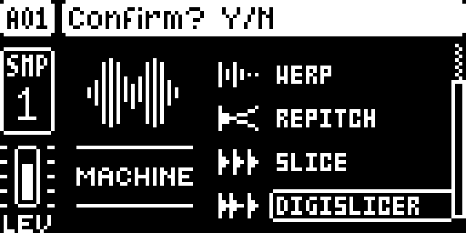
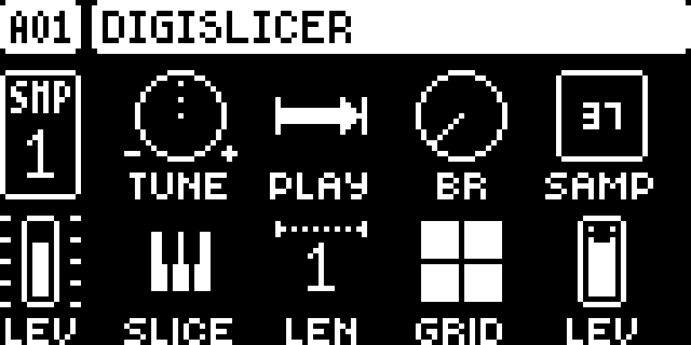
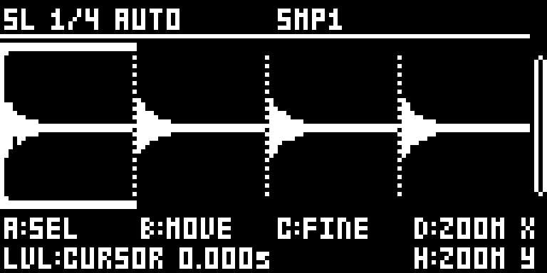

# DIGISLICER — Digitakt

Modwerk documentation version: `2.1.1-experimental`. This editorial update adds the guide, LCD captures and frontend descriptions; the pinned native source, build recipe and existing test evidence are unchanged.

## Overview

DIGISLICER adds a separate SRC machine with a waveform slice editor to the original Digitakt. Select it below SLICE, choose a sample and press SRC again to edit starts, create a grid or slice on transients. Custom slices belong to the sample and take precedence over GRID on every DIGISLICER track using it; they are saved to the +Drive after closing the editor. GRID adds AUTO and PLAY adds PIPO for forward/backward looping across the slices covered by LEN. With FUNC + TRK keyboard mode enabled, trig keys play slices at the track’s pitch and can record slice locks. The stock SLICE machine retains its normal behavior.

- Edit up to 64 slices with coarse/fine start adjustment, a cursor and horizontal/vertical waveform zoom.
- Use transient AUTO slicing or 4/8/16/32/64-slice grids with starts moved to zero crossings.
- Custom slices follow the sample across projects and override GRID on DIGISLICER tracks.
- Keyboard mode plays one slice per trig key, with four pages and live recording of slice locks.
- PIPO ping-pongs for the note’s duration, including spans of multiple slices set with LEN.

## Controls

| Control | What it does |
| --- | --- |
| Knob A | In the editor, select a slice one per notch; the cursor jumps to its start. In the slice menu, choose an action, then press YES to apply it. |
| Knob B | In the editor, move the selected slice’s start. This edits the shared slice layout for the sample, not only this track. |
| Knob C | In the editor, fine-adjust the selected start one sample at a time. |
| Knob D | In the editor, zoom horizontally around the cursor. Faster turns zoom faster; move the cursor with LEVEL to focus on another region. |
| Knob H | In the editor, enlarge the waveform vertically up to 64 times to inspect quiet material; this changes the view, not the audio level. |
| LEVEL | In the editor, move the waveform cursor; the view scrolls to keep it visible. YES then offers ADD SLICE HERE when a new start is allowed at that position. |
| FUNC + YES | In the editor, run AUTO SLICE on the sample’s transients. This replaces the sample’s existing custom slice layout. |
| YES | Open the slice menu. UP / DOWN or knob A choose ADD SLICE HERE, SPLIT SLICE, DELETE SLICE, AUTO SLICE, CREATE GRID or DELETE ALL; YES applies the action and NO cancels the menu. |
| SAMP | On the SRC page, choose the track’s sample. In the editor, FUNC + LEFT / RIGHT changes the sample slot and updates the track’s SAMP selection. |
| GRID | On the SRC page, select an equal slice grid or AUTO, one step past 64, for transient slices. A sample’s custom slices override this setting; DELETE ALL in the editor restores GRID-based playback. |
| SLICE | On the SRC page, choose the played slice; slice locks sequence different slices. In keyboard mode each trig key chooses its own slice at the track’s pitch, regardless of the current SLICE value. |
| LEN | On the SRC page, choose how many slices a note spans. In PIPO mode the voice turns at the end of the last slice covered by LEN and returns to the first slice’s start. |
| PLAY | On the SRC page, retain the stock playback modes or choose PIPO, one step past FWD, for ping-pong looping while the note lasts. Each new note starts forward; the page shows a bidirectional loop icon. |
| TUNE / BR / LEV | On the SRC page, the stock SLICE-style pitch, bit reduction and source-level controls still apply. Keyboard slice keys keep the track’s pitch; they select slices rather than transpose notes. |
| LEFT / RIGHT | In the editor, select the previous or next slice and audition it while the key is held. In CREATE GRID, choose 4, 8, 16, 32 or 64 slices. |
| Trig keys / UP / DOWN | In the editor, trig keys select and audition slices 1–16 while held; UP / DOWN select later groups up to slice 64. Outside the editor, FUNC + TRK keyboard mode uses the same slice pages; keys beyond the slice count stay dark and silent. |
| FUNC + NO | In the editor, delete the selected slice; its start merges into the preceding slice. Use NO without FUNC to leave the editor and keep the layout. |
| SRC / NO / page keys | SRC or NO closes the editor and keeps the slices; TRIG, FLTR, AMP or LFO closes it and opens that page. Slices are saved to the +Drive about a second later. PLAY and STOP keep their normal transport functions. |
| FUNC + TRK / recording | Outside the editor, FUNC + TRK enables slice keyboard mode. REC + PLAY records played slices as locks. In STEP REC (REC + STOP), FUNC + a trig key writes that slice at the cursor. |

The manifest leaves numeric defaults unspecified. The tutorial below gives example settings, not a new set of factory defaults.

## Usage

Use the access steps below after installing a compatible build. The tutorial gives a first practical pass through the module.

### Where to find it

Location: SRC machine list, below SLICE.

1. Use a build containing DIGISLICER for the original Digitakt on OS 1.53 or 1.54.
2. Select an audio track, press FUNC + SRC, choose DIGISLICER below SLICE and select a sample with SAMP.
3. From the SRC parameter page press SRC again to open the slice editor. SRC or NO closes it; another page key closes it and opens that page.
4. For slice performance outside the editor, enable keyboard mode with FUNC + TRK. UP / DOWN select groups of 16 slices.

These instructions assume the module is already installed in a compatible build. For selecting and building it in Modwerk, see the [Digitakt guide](../../../machines/digitakt/README.md).

### Quick tutorial: chop and play a drum loop

1. Choose DIGISLICER with FUNC + SRC, assign a drum loop with SAMP, then press SRC again to open its waveform editor.
2. Press YES for the slice menu, select CREATE GRID with UP / DOWN, choose 16 with LEFT / RIGHT and confirm with YES. This replaces the sample’s existing slice layout.
3. Select a slice with knob A. Adjust its start with B and fine-tune with C; use D to zoom around the cursor and H to enlarge quiet waveform details.
4. Close the editor with SRC or NO and wait at least a second for the slices to save. They now play on every DIGISLICER track using this sample, regardless of GRID.
5. Enable keyboard mode with FUNC + TRK and play the slices from trig keys 1–16. UP / DOWN select later slice pages; REC + PLAY records the played keys as slice locks.
6. Press STOP and leave recording/keyboard mode when finished. To remove the custom layout, reopen the editor and choose YES → DELETE ALL; playback returns to the SRC page’s GRID setting.

The main SRC page keeps the stock SLICE controls, with AUTO added to GRID and PIPO added to PLAY. In the editor, knobs E, F and G have no documented action. The cursor sits at the selected start until LEVEL moves it; horizontal zoom centers on that cursor. The playhead line shows the playing position, and a tick in the sample overview keeps it visible when the waveform is zoomed elsewhere.

### Slice menu reference

| Action | Result |
| --- | --- |
| ADD SLICE HERE | Add and select a start at the cursor. It is available only with fewer than 64 slices and at least 64 samples from an existing start or the sample end. |
| SPLIT SLICE | Divide the selected slice at its midpoint. |
| DELETE SLICE | Remove the selected start, joining that region to the preceding slice. |
| AUTO SLICE | Replace the layout with transient-based slices. |
| CREATE GRID | Replace it with 4, 8, 16, 32 or 64 equal slices; starts move back to zero crossings. LEFT / RIGHT chooses the count. |
| DELETE ALL | Remove the custom layout and return to the SRC page’s GRID playback. |

The menu is edited with UP / DOWN or knob A, confirmed with YES and cancelled with NO. Layout changes affect the sample wherever it is used by DIGISLICER.

## Compatibility and limitations

- Original Digitakt (Mk1), OS 1.53 or 1.54, with core 2.1 or later. The pinned upstream guide labels current editor and keyboard checks as emulator evidence, not a hardware pass.
- Custom slices are shared by sample content across DIGISLICER tracks and projects. Editing one track’s layout changes how the same sample plays elsewhere.
- Up to 64 custom slices per sample. They are stored in `/cfw/slices.a` and `/cfw/slices.b`; the `/cfw` directory appears in the sample browser. Wait about a second after leaving the editor before powering down.
- The stock SLICE machine ignores custom layouts and does not gain AUTO, PIPO or the editor. Switching from DIGISLICER can leave PIPO displayed on SLICE, where it plays as FWD until PLAY is changed.
- A project loaded without DIGISLICER turns that machine into ONESHOT. For old 1.x projects that used the modified SLICE machine, switch the affected tracks to DIGISLICER to use their saved slices.
- The author’s OS 1.54 cold-boot checks covered screens and silence; sample-backed editor/playback checks were recorded on OS 1.53. No new Modwerk hardware or audio qualification is claimed.

## Tests and measurements

The Modwerk evidence tier remains `none`. [TESTING.md](TESTING.md) records the UI capture run, exact source/build identities and the separate imported author evidence. The captures do not qualify audio, timing, persistence or hardware.

The imported release-object memory estimate is **92,190 B**, excluding the shared core and linker alignment. Modwerk CPU/audio load remains unmeasured. Upstream results in the [pinned author guide](upstream/README.md) describe the author's builds and are separate from this revision's evidence.

## Authorship and licences

- irpina — DIGISLICER design and code

The module is licensed under [GPL-2.0-or-later](LICENSE). Imported source: [irpina/digislicer at `ac0c46d86072`](https://github.com/irpina/digislicer/tree/ac0c46d8607205352adcd0f49fb09a4736edda17). The source pin and upstream notices are retained. More detail is in [upstream/README.md](upstream/README.md).

## Screens and audio

Real firmware-rendered emulator captures on OS 1.53. The [capture record](media/capture.json) includes source/build identities, panel inputs, timestamps and PNG hashes. [Capture rights](media/LICENSE.md) preserve the underlying interface rights. The [thumbnail](media/thumbnail.svg) is an illustration. No audio demonstration is claimed.

DIGISLICER in the machine chooser.

DIGISLICER SRC controls before assigning the loop.

Waveform editor with the original DOC_LOOP fixture.
