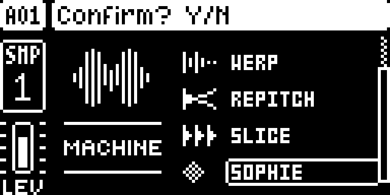
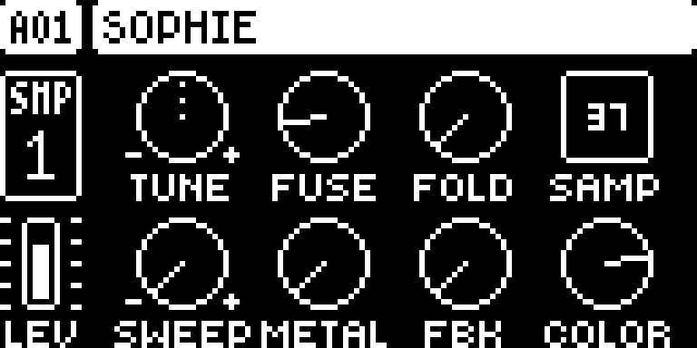
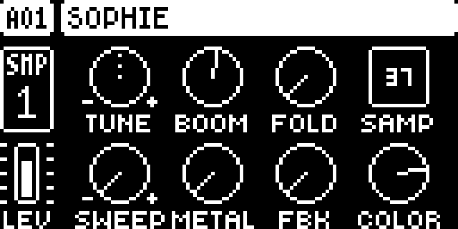
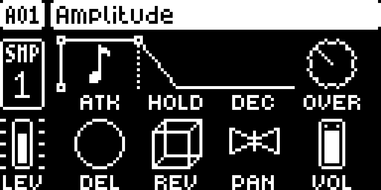

# SOPHIE — Digitakt

Modwerk documentation version: `1.1.13-experimental.2`. This editorial update adds the guide, LCD captures and frontend descriptions; the pinned native source, build recipe and existing test evidence are unchanged.

## Overview

SOPHIE is a metallic percussion synth SRC machine for the original Digitakt on OS 1.53. Sjoerd (Soejrd) adapted Matt Estela’s Sophie for Schwung into four models: FUSE’s bright clang, BOOM’s rounded low body, PIPE’s inharmonic ring and SHARD’s grainy tone/noise attack. TUNE and trig notes set pitch; SWEEP shapes the pitch attack, METAL and COLOR set the metallic character, FBK adds oscillator feedback and FOLD folds the output. The synth feeds the normal AMP, filter, mixer and sends without needing a sample. AMP controls note duration, and custom SRC controls accept parameter locks. Start with one SOPHIE track; the author’s earlier hardware test found two practical with FAST AUDIO, without claiming eight-track operation.

- Four source models: FUSE, BOOM, PIPE and SHARD, with lockable synthesis controls.
- Bipolar SWEEP starts above or below the played pitch; zero removes the pitch sweep.
- FOLD adds compensated wavefolding; zero bypasses it. The stock SAMP slot is unused by the synth.
- AMP HOLD = NOTE follows TRIG LEN; a finite DEC gives a release, while DEC = INF can sustain indefinitely.

## Controls

| Control | What it does |
| --- | --- |
| TUNE | SRC knob A: pitch, combined with the trig’s note. The normal Digitakt AMP, filter and effects process the resulting synth voice. |
| MODEL | SRC knob B: choose FUSE (bright clang), BOOM (rounded sine body and FM attack), PIPE (inharmonic ring) or SHARD (grainy tone with a short noise attack). Each track has one voice; retriggering replaces it. |
| FOLD | SRC knob C: output wavefolder, 0–127. Zero bypasses it; increasing it adds folds with level compensation before the stock AMP/filter chain. It replaces this machine’s BR control. |
| SAMP | SRC knob D: retained stock sample selector. SOPHIE generates its own audio and does not use the selected sample. |
| SWEEP | SRC knob E: bipolar pitch attack, -64 to +63, centered at 0. Positive starts above the played pitch and falls; negative starts below and rises. FUNC + turning uses stock TUNE octave steps (-60 to +24). |
| METAL | SRC knob F: FM/ring intensity, 0–127. Higher settings increase metallic modulation; its interaction with COLOR and FBK depends on MODEL. |
| FBK | SRC knob G: oscillator feedback, 0–127. Increase gradually to change the model’s edge and harmonics; this is synthesis feedback, not the delay send’s feedback. |
| COLOR | SRC knob H: inharmonic character, 0–127. Moves through different oscillator-ratio bands for each model; on SHARD it also shapes the noise character. |

The manifest leaves numeric defaults unspecified. The tutorial below gives example settings, not a new set of factory defaults.

## Usage

Use the access steps below after installing a compatible build. The tutorial gives a first practical pass through the module.

### Where to find it

Location: SRC machine list.

1. Use a build containing SOPHIE for the original Digitakt on OS 1.53; digihealth is optional.
2. Select an audio track, press FUNC + SRC and choose SOPHIE from the machine list.
3. Adjust TUNE through COLOR on the SRC page. Set note duration and release on AMP, then trigger the track from the sequencer or keyboard.

These instructions assume the module is already installed in a compatible build. For selecting and building it in Modwerk, see the [Digitakt guide](../../../machines/digitakt/README.md).

### Quick tutorial: sequence a metallic percussion voice

1. On one audio track choose SOPHIE with FUNC + SRC. No sample is needed; choose FUSE with MODEL for this example.
2. Set SWEEP to 0 and FOLD to 0. On AMP set HOLD to NOTE and choose a finite DEC, so TRIG LEN determines when the release begins.
3. Add a few trigs and play the pattern. Adjust TUNE for pitch, then raise METAL and turn COLOR to explore the clang’s harmonics; add FBK gradually.
4. Parameter-lock MODEL on a trig to compare BOOM, PIPE and SHARD, or lock SWEEP above/below zero for a descending/ascending pitch attack. Try FOLD, then return it to 0 to bypass wavefolding.
5. Press STOP and let the finite AMP release finish. Remove the example locks and return SWEEP and FOLD to 0 for the starting sound; avoid DEC = INF if you want notes to finish.

The normal AMP page shapes the voice: HOLD = NOTE follows TRIG LEN, and finite DEC lets the note release. DEC = INF can keep it sounding indefinitely. Retriggering chokes the previous voice on that track with a short transition. FLTR, pan and delay/reverb sends remain available; SAMP does not choose the sound. Numeric starting values are not declared in the Modwerk manifest: the tutorial settings are an example, not factory defaults.

### Choosing a model

| Model | Character described by the pinned renderer |
| --- | --- |
| FUSE | Bright clang that settles as FM depth recedes. |
| BOOM | Round sine body with a decaying FM attack. |
| PIPE | Cross-modulated tone with an inharmonic ring. |
| SHARD | Quantized tone and a short noise attack. |

MODEL, COLOR, METAL and FBK interact, so compare models using the same pitch and AMP envelope. These descriptions come from comments in the imported renderer, not new listening-test results.

## Compatibility and limitations

- Original Digitakt (Mk1), OS 1.53 only, with core 2.1. OS 1.54 and Digitakt II are not declared compatible.
- digihealth is optional, not a dependency. One instance runs without FAST AUDIO; the author’s earlier hardware test found two practical with it enabled. Eight simultaneous SOPHIE tracks are not claimed.
- The pinned author README distinguishes the older hardware-tested release from later source revisions. That history does not qualify this Modwerk metadata revision.
- FOLD replaces BR on SOPHIE’s SRC page; SAMP remains visible but has no effect on synthesis. DEC = INF can sustain notes indefinitely.

## Tests and measurements

The Modwerk evidence tier remains `none`. [TESTING.md](TESTING.md) records the UI capture run, exact source/build identities and the separate imported author evidence. The captures do not qualify audio, timing, persistence or hardware.

The imported release-object memory estimate is **8,722 B**, excluding the shared core and linker alignment. Modwerk CPU/audio load remains unmeasured. Upstream results in the [pinned author guide](upstream/README.md) describe the author's builds and are separate from this revision's evidence.

## Authorship and licences

- Sjoerd (Soejrd) — DigiSophie development and Digitakt adaptation
- Matt Estela (@mestela) — original Sophie for Schwung algorithm

The module is licensed under [MIT](LICENSE). Imported source: [soejrd/digisophie at `961c39cec699`](https://github.com/soejrd/digisophie/tree/961c39cec699e8f8940391634aaba9fad7120792). The source pin and upstream notices are retained. More detail is in [upstream/README.md](upstream/README.md).

## Screens and audio

Real firmware-rendered emulator captures on OS 1.53. The [capture record](media/capture.json) includes source/build identities, panel inputs, timestamps and PNG hashes. [Capture rights](media/LICENSE.md) preserve the underlying interface rights. The [thumbnail](media/thumbnail.svg) is an illustration. No audio demonstration is claimed.

SOPHIE in the machine chooser.

FUSE model source controls.

BOOM model source controls.

Track amplifier controls.
