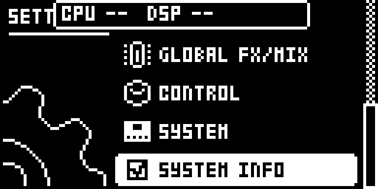
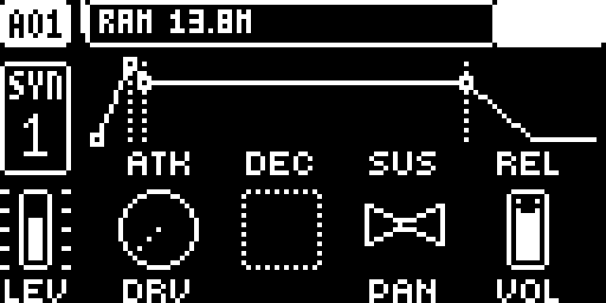
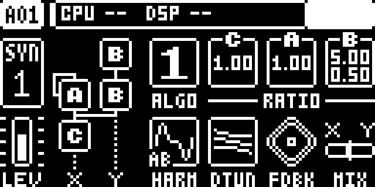

# digihealth — Digitone

Modwerk documentation version: `1.1.2-experimental`. This editorial update adds the guide, LCD captures and frontend descriptions; the pinned native source, build recipe and existing test evidence are unchanged.

## Overview

digihealth adds SYSTEM INFO to SETTINGS on the original Digitone and Digitone Keys running OS 1.43. The top bar alternates main-CPU load and audio-render current/peak load with free heap RAM. The DSP label measures effects and mixing on the main CPU; the FM voices run on the second CPU and their load is not shown. Digitone has no sample-memory readout, and this port has no FAST AUDIO setting. A read-only USB SysEx diagnostics channel uses device byte 0x7D.

- SYSTEM INFO alternates load and free-RAM pages every two seconds.
- DSP shows effects/mix render load and its last-second peak, rather than the second CPU’s FM voice load.
- Read-only USB diagnostics are available; FAST AUDIO is a Digitakt-only feature.

## Controls

| Control | What it does |
| --- | --- |
| SYSTEM INFO | Tick in SETTINGS to alternate CPU and audio-render DSP current/last-second peak with free heap RAM every two seconds. DSP covers the main CPU’s effects and mix; the separate FM voice CPU is not measured. Untick to hide the readout. |

The manifest leaves numeric defaults unspecified. The tutorial below gives example settings, not a new set of factory defaults.

## Usage

Use the access steps below after installing a compatible build. The tutorial gives a first practical pass through the module.

### Where to find it

Location: SETTINGS.

1. Use a build containing the Digitone port of digihealth on an original Digitone or Digitone Keys with OS 1.43.
2. Open SETTINGS and tick SYSTEM INFO.
3. Return to a pattern to view the alternating load and free-RAM figures in the top bar; untick SYSTEM INFO to hide them.

These instructions assume the module is already installed in a compatible build. For selecting and building it in Modwerk, see the [Digitone guide](../../../machines/digitone/README.md).

### Quick tutorial: watch the effects and mix workload

1. Open SETTINGS, tick SYSTEM INFO and return to a pattern with a few FM tracks.
2. Play the pattern. Read CPU and DSP current/peak figures, then wait for free RAM; the top-bar pages alternate every two seconds.
3. Keep the notes unchanged and adjust a delay or reverb send to observe the effects/mix workload. DSP does not show the separate FM voice CPU’s load.
4. Stop playback, restore the example send settings and untick SYSTEM INFO in SETTINGS to return to the normal top bar. There is no FAST AUDIO toggle on this port.

Use the readout to compare the same pattern as you adjust effects and mixing. It cannot establish FM voice headroom because it does not measure the second CPU. No numeric starting value is declared for the SYSTEM INFO checkbox in the Modwerk manifest.

### Optional USB diagnostics

The pinned author guide describes the read-only HELLO, STATS and PEEK SysEx commands on device byte `0x7D`. Its Windows `tools/digiusb.py` is an upstream tool, not bundled here. Close Elektron Transfer before opening that MIDI port in the tool. The SETTINGS readout works without a computer.

## Compatibility and limitations

- Original Digitone (Mk1) and Digitone Keys, OS 1.43 only. The machine profile also lists OS 1.44, but this module does not declare support for it.
- This port shows SYSTEM INFO and USB diagnostics only. FAST AUDIO belongs to the Digitakt port, and the Digitone has no sample-memory page.
- CPU and DSP refer to the main CPU. DSP covers audio effects and mixing, not FM synthesis on the second CPU; no FM capacity estimate follows from these readings.

## Tests and measurements

The Modwerk evidence tier remains `none`. [TESTING.md](TESTING.md) records the UI capture run, exact source/build identities and the separate imported author evidence. The captures do not qualify audio, timing, persistence or hardware.

The imported release-object memory estimate is **4,500 B**, excluding the shared core and linker alignment. Modwerk CPU/audio load remains unmeasured. Upstream results in the [pinned author guide](upstream/README.md) describe the author's builds and are separate from this revision's evidence.

## Authorship and licences

- irpina — digihealth design and code

The module is licensed under [GPL-2.0-or-later](LICENSE). Imported source: [irpina/digihealth at `6d2a95605901`](https://github.com/irpina/digihealth/tree/6d2a95605901f4f5ea6301dbad16e573380331a6/dn1). The source pin and upstream notices are retained. More detail is in [upstream/README.md](upstream/README.md).

## Screens and audio

Real firmware-rendered emulator captures on OS 1.43. The [capture record](media/capture.json) includes source/build identities, panel inputs, timestamps and PNG hashes. [Capture rights](media/LICENSE.md) preserve the underlying interface rights. The [thumbnail](media/thumbnail.svg) is an illustration. No audio demonstration is claimed.

SYS INFO in Settings.

Memory overlay on AMP.

Load overlay on SYN1; timing counters unavailable.
