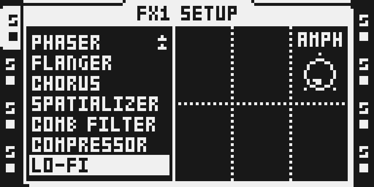
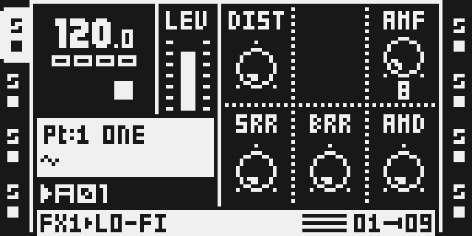

# LO-FI AMF Fix

Version 0.1.0-experimental · author: [@bryantysinger](https://github.com/bryantysinger) · octabam declaration by [@sambanks](https://github.com/sambanks)

## Overview

Stock LO-FI's AMF parameter sets the frequency of its ring modulator. On OS 1.40C the frequency does not always rise when AMF goes up: at eleven values (8, 17, 23, 28, 32, 35, 37, 40, 42, 45 and 48) it falls instead, worst at AMF 7 to 8, where the pitch drops by about 63%. Above 48 the sweep is monotonic again.

The cause is one DSP instruction. LO-FI builds its AMF coefficient with an extended-precision multiply whose first step is `mpysu x0,y0,a` (signed × unsigned). Both operands are magnitudes, and the low word in `x0` sometimes has its top bit set; read as signed, that flips the partial product's sign, and the following `dmac` only repairs some of those cases. The fix is the unsigned × unsigned form, `mpyuu x0,y0,a`, a one-bit change in the instruction word.

The Octatrack has two DSP chips, each with its own copy of LO-FI, so the module rewrites the instruction in both: payload A (tracks 5-8) at P:0x01bef and payload B (tracks 1-4) at P:0x019af. Nothing else changes.

## Controls

None. The module has no knob, page, menu or effect id. It changes how stock LO-FI's own AMF parameter is computed; DIST, SRR, BRR, AMD and AMPH are untouched.

## Usage

Include LOFI AMF FIX when you build your firmware, then use LO-FI exactly as before on FX1 or FX2 of any track. AMF, including LFO-, scene- and parameter-lock-driven AMF and fine values made with an LFO's depth, now sweeps the ring-modulator frequency upward without the backward jumps.

### Quick tutorial: hear AMF rise from 7 to 8

1. Select a track with its track key (T1-T8) and press [FUNC] + [FX1] to open FX1 SETUP; scroll to LO-FI in the list (FX2 works the same with [FUNC] + [FX2]).
2. Press [FX1] to open LO-FI's page, play a sustained sound on the track and set AMF (top right, knob C) to 7.
3. Turn AMF to 8: the ring-modulator pitch now rises a little instead of dropping by about 63% as on stock.
4. To compare with or return to stock behaviour, build the firmware without LOFI AMF FIX; there is no runtime switch.

## Compatibility and limitations

- OS 1.40C, Octatrack MKI and MKII. Applies to LO-FI on FX1 and FX2 on all eight tracks.
- Two fixed addresses, one per DSP payload. Each write is guarded by the SHA-256 of the stock word it replaces, read from your own OS file at build time, so the build refuses if anything has moved or changed LO-FI's code.
- Claims no free space, cave, hook or effect id, so it composes with other modules unless one of them rewrites the same LO-FI words. CHARACTER now runs on its own id (0x1a) and leaves stock LO-FI in place.
- Not yet compared with native octabam in this repository and not yet run on hardware; see [TESTING.md](TESTING.md).

### Change to a stock flow: LO-FI's AMF pitch

- **What changes, and for whom.** Anyone who builds with this module and uses LO-FI. At AMF 8, 17, 23, 28, 32, 35, 37, 40, 42, 45 and 48, and at LFO, scene or fine values between AMF 7 and 49 that land in the affected ranges, the ring modulator runs at the corrected, higher frequency instead of stock's lower one. **Saved projects and Parts that use those settings will sound different**: their ring-mod pitch moves to where the knob says it should be. Nothing in the project files changes; the same stored AMF byte simply produces the intended frequency.
- **Why.** The stock behaviour is a firmware bug (the wrong multiply signedness), reported to Elektron and not fixed upstream. The module's only purpose is to remove it, and the author's position is that the erroneous pitch should not be preserved.
- **What else was considered.** A runtime on/off switch would need ColdFire code and a new menu row or page slot, a larger change to a stock flow than the fix itself. A separate "LO-FI FIX" effect beside stock LO-FI would leave stock untouched but needs a free effect id and a relocated copy of LO-FI's code. Both cost far more than a two-bit change, for the sole benefit of keeping the bug reachable.
- **What a musician sees and does differently.** Nothing on screen changes. Turning AMF up always raises the pitch. A project that relied on the stock pitch at an affected value needs AMF re-tuned by ear.
- **How to turn it off.** Build without LOFI AMF FIX. There is no runtime switch.
- **Neighbouring flows to check.** LO-FI's other parameters, LFO and scene modulation of AMF, parameter locks, Part and project save/reload, FX1 vs FX2, tracks 1-4 vs 5-8. Which of these have actually been run is recorded in [TESTING.md](TESTING.md); none has yet.

## Tests and measurements

What exists today: upstream disassembled both sites against the stock image (`mpysu x0,y0,a` before, `mpyuu x0,y0,a` after), and in this repository the declaration imports and resolves its two guarded pokes without firmware. The author's original work on octa-bt-pt swept AMF 0-127 × fine 0-127 (16,384 points) through the DSP emulator with the fix applied and found no monotonicity violations; that sweep is not reproduced here. Native comparison, packages, the performance record, captures and hardware tests are pending. Details and commands are in [TESTING.md](TESTING.md).

## Authorship and licences

- The fix, its root cause and the original patch: Bryan Tysinger, [bryantysinger/octa-bt-pt](https://github.com/bryantysinger/octa-bt-pt), MIT.
- The octabam module declaration and [upstream/README.md](upstream/README.md): Sam Banks, [sambanks/octabam](https://github.com/sambanks/octabam) at `063a42626a40f863c0e1b056155b74f8b5666004`, MIT.
- Modwerk's transform (plain `Poke`s with stock guards in place of stock bytes), this README, TESTING.md and the thumbnail: Modwerk contributors, MIT.

Both licence texts are in [LICENSE](LICENSE) in full. No Elektron firmware, extracted stock routine or table is included; the stock word is referenced by address, length and SHA-256 and read from each builder's own OS file.

## Screens and audio

The module has no screen of its own; both captures are stock pages, unchanged by it, showing where to hear the fix. They come from the headless emulator running an original OS 1.40C with only the module's two writes applied (`media/capture.json` has the image and emulator hashes and the panel plan).

- [FX1 SETUP](media/ot-fx1-setup-lofi.png): [FUNC] + [FX1], LO-FI highlighted.
- [LO-FI's page](media/ot-lofi-amf.png): [FX1], AMF (knob C, top right) at 8.

No audio is included.
