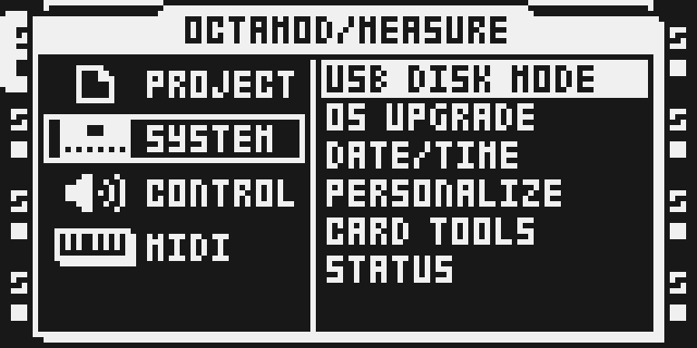
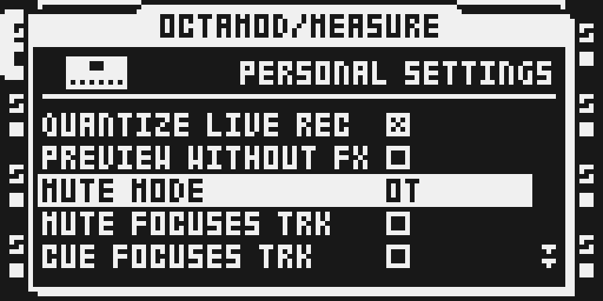
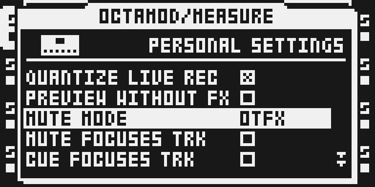
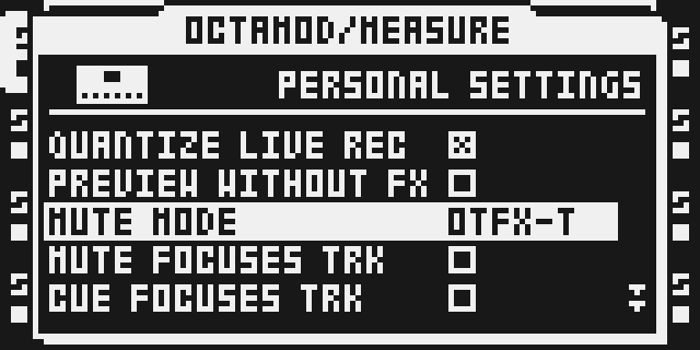

# Mute Modes

## Overview

Choose a stock cut, FX tails, trig suppression or amp-envelope completion for muted and soloed-out audio tracks.

Source-only draft, version `0.1.0-experimental`. It is not offered by the configurator while shared-builder integration and release qualification remain incomplete.

## Controls

| Mode | Behavior |
|---|---|
| OT | Immediate post-FX cut, as on stock. |
| OTFX | Cut the dry signal; FX tails continue and trigs keep firing. |
| OTFX-T | Cut the dry signal with FX tails and suppress new trigs. |
| DT-T | Let the active voice finish its amp envelope and suppress new trigs. |

In PERSONALIZE, RIGHT/LEFT clamp at the ends and YES cycles with wraparound. The stored gate order differs from the displayed order; the getter/setter translate it from one persisted word.

## Usage

The setting affects muted and soloed-out audio tracks globally. Existing stock track mute gestures are retained. It does not add a MIDI mute mode or an FX slot.

### Quick tutorial: keep FX tails when muting

1. Open PROJECT > SYSTEM > PERSONALIZE and select MUTE MODE.
2. Choose OTFX to cut the dry signal while delay and reverb tails continue; trigs keep firing underneath.
3. Mute and unmute an audio track with a long delay or reverb tail, then try OTFX-T to suppress new trigs.
4. Choose DT-T to let the current voice finish its amp envelope, or OT to restore the stock cut.

## Compatibility and limitations

OS 1.40C only, MKI and MKII source support; current Modwerk hardware testing is pending.

- OT is the default. The global PERSONALIZE setting is stored in battery SRAM; it is not a Part or project setting.
- An OS upgrade resets PERSONALIZE. Saving or switching Parts/projects does not make the mode project-specific.
- SIDECHAIN_COMPRESSOR requires its SC_KEY assembly variant so a muted key continues feeding the compressor.
- No effect slot is consumed. Audio tracks and solo exclusions are affected; MIDI track mute behavior is unchanged.
- The current shared SDK lacks TableGrow.insert_at and selection-dependent Linked.reference support; catalog publication and native/browser composition remain pending.

## Tests and measurements

Source identity, actual native-code probes, instruction counts, conservative core-cycle bounds and stack peaks are recorded in [TESTING.md](TESTING.md). Stock callbacks and chip wall-clock behavior are explicit exclusions. The qualification template contains pending fields and does not qualify this release.

## Authorship and licences

Zac-Kyoti: mute runtime, PERSONALIZE menu and author byte references. Sam Banks: octabam integration. Original MIT notices are retained in [LICENSE](LICENSE). See `../../imports/mute-modes-6f9e5bc.json` for exact repository pins and per-file transformations. Original Modwerk probes use GPL-3.0-or-later; authored source is unchanged. No stock firmware, extracted tables/routines, compiled image or card is distributed here.

## Screens and audio

Actual native LCD captures were reviewed in monochrome. Their image, emulator, panel plan and PNG hashes are recorded in [media/capture.json](media/capture.json). These use a locally composed standalone image and a DSP host stub; they do not establish audio continuity, a valid loaded project, common-builder parity or physical hardware behavior.

