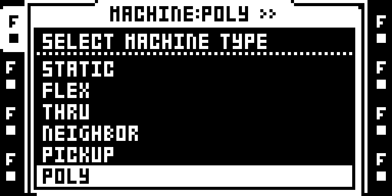
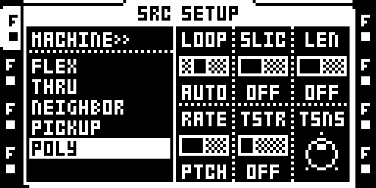

# Poly Machine — development draft

POLY is a FLEX sample machine with **up to eight voices and one POLY assignment per Part**. Each voice
has its own pitch, playback position and AMP envelope; filters and FX remain
per track. This replaces the earlier 32-voice experiment after an MKII report
of temporary unresponsiveness during rapid trig presses with HOLD/REL INF.
Released tails yield before held notes. A pitch-weighted work budget admits
fewer voices at high playback ratios, including after a tuning change.

PTCH tunes the whole chord. Panel and MIDI notes add their own semitone offset
without moving PTCH or overwriting its live lock. The machine follows the
instrument's audio frames and sequencer; it has no independent clock.

This is an experimental source draft, outside the public catalog. **POLY8T06 is the private consistency/performance candidate.** It preserves the existing LOOP choice when reselecting POLY, restores the correct machine cursor when leaving the FLEX slots, and reduces ColdFire interpolation/mixer work. Both original 1.40C DSP upload payloads remain byte-identical; the private build refuses an automatic dynamic loader or DSP drift.

**POLY8T03 and POLY8T04 failed MKII transport testing.** T04's physical logs match its exact source/configuration identity, show continuing UI activity and zero sample-render entries during the captured PLAY state, and contain no exception. T04 therefore does not reach POLY mixing in that capture. The user subsequently described T05 as “works in theory”; no individual hardware gates were reported. T06 retains native command-consumer/AMP-builder counts beside the existing core logger. MKII recording, responsiveness and physical reboot still need this exact version's hardware test. Stock 1.40C reportedly restores operation in the same project.
## Controls and flow

| Control | Behaviour |
| --- | --- |
| SRC SETUP → POLY | Selects POLY and opens the native FLEX sample pool directly. |
| FLEX pool | Stock slot selection and file loading; no STATIC/FLEX chooser. |
| PTCH | Tunes every active/releasing voice independently of note input. |
| Chromatic keys | Separate notes and releases, with held-key boxes. |
| FUNC + LEFT/RIGHT | Ten octave positions, -6 through +3; endpoints clamp. |
| MIDI | Notes 0–127 on exclusively POLY routes; note 84 is the tuned sample root. |
| AMP | Independent ATK/HOLD/REL envelopes. REL INF intentionally sustains released voices. |
| SRC SETUP | Native FLEX settings; TSTR is OFF, and new assignments default to LOOP OFF. |

## Usage

1. Select an audio track, open SRC SETUP, choose POLY and press YES.
2. POLY opens the FLEX sample pool directly. Load a sample with the stock file browser, then confirm its slot with YES. NO leaves the browser.
3. Return to SRC, open the trig-mode menu with FUNC+DOWN, select CHROMATIC and confirm with YES. Hold several trig keys; FUNC+LEFT/RIGHT changes octave from -6 to +3.
4. Turn PTCH to transpose the sounding chord. A dedicated POLY MIDI channel accepts notes 0–127; note 84 plays the tuned sample root.
5. Set AMP REL to a finite value for notes that end after key-up. The one assigned POLY machine has up to eight voices, subject to the pitch-work budget.

A second POLY assignment in the same Part is refused before changing the target
track, its sample or settings. The native modal says **ONE POLY PER PART**;
press **NO** to dismiss it. Each inactive Part may store its own POLY machine.
Reduce older Parts containing several POLY markers to one before this test.

Every voice is mixed at a fixed **1/8 gain (-18.06 dB)**, including the single
voice fast path and attack/release ramps. Eight coherent full-scale voices fit
within the mix range without a gain change each time another note starts.
A single note is quieter than the previous build; downstream AMP/FX boosts can
still use that headroom.

## Runtime and recording

Eight stock primary records and 31 fixed extension records are retained for
compatibility with the earlier experiment. Admission limits active heads to
eight, with a conservative budget of 40 fixed-plus-fetch units. No per-note
allocation occurs. The platform still reserves 10 MiB once.

REC+PLAY in chromatic mode records the held panel chord, up to four distinct
notes spanning eleven semitones. Native recorder routines choose the bank,
pattern, step and microtiming. Chords occupy the existing pattern lock records:
slot 0 stores the note root and unused audio slot 30 stores one of 232 chord
shapes. Slot 31 remains native SAMPLE. Playback consumes encoded roots before
PTCH locking, leaving the Part tuning, other locks, scenes and LFO destinations
on their stock path. No sidecar file or independent sequencer clock is added.

Recorded duration follows AMP HOLD; key-up duration is not captured. Larger or
wider held chords do not overwrite the last valid capture. Stock grid PTCH-lock
editing/display of an encoded root is not qualified. Without POLY installed,
that step falls back to one FLEX note using its encoded PTCH byte.

HOLD and REL INF intentionally sustain a voice; LOOP OFF allows a finite sample
to end naturally. New assignments take LOOP OFF, while existing Parts and
browser confirmations preserve the saved choice. Set existing POLY tracks to
LOOP OFF manually when testing this build.

## Compatibility and limitations

- Octatrack OS 1.40C only; this 0.2.5 candidate has not yet been tested on physical hardware.
- FLEX only. STATIC was excluded after an exploratory audio test lost chord
  components as independent streaming heads diverged.
- Panel recording is limited to four notes within an octave; extended MIDI recording is incomplete.
  Ordinary uncaptured sequencer trigs play the tuned root. Shared MIDI channels retain
  stock commands outside 72–96 if any routed audio track is not POLY.
- Ratios saturate below 32× without octave folding. Linear interpolation can
  alias; very low notes have limited Q16 playback-phase resolution. An earlier
  maximum-pitch load did not establish 32 simultaneous high voices.
- The octave is global live state, not saved in a Part. Stock octave LEDs clamp
  to their four available positions; the printed signed octave is exact.
- At most 64 distinct owners can remain held per track, with 31 queued presses
  behind the armed stock mailbox. Excess queued input is rejected before it
  becomes a held note.
- Scenes, LFOs/locks, slices/reverse combinations, project/Part reload, recorder
  activity and machine changes under load need broader qualification.
- VECTOR, Analog BD, FM Synth and Quantizer overlap the registration hooks.
  Their integration was used as a reference; coexistence is not claimed.
  OctaKit's Part layout is incompatible.

POLY uses a `PL/1` signature in three unused NEIGHBOR bytes while retaining
FLEX's native machine byte. Both Part copies are updated. Legacy raw-type-5
POLY95 Parts migrate to signed FLEX when visited.

## Validation and provenance

[TESTING.md](TESTING.md) separates measured results from remaining work.
[import.json](import.json) records the exact preservation archive and source
hashes. Historical [upstream notes](upstream) describe POLY95, not this draft.
Stock replay placeholders are filled from the developer's locally verified OS;
no firmware, extracted stock spans, card images or memory dumps are included.

Sam Banks' original POLY is MIT; full terms are in [LICENSE](LICENSE).
The pool adapter follows repeat98's MIT VECTOR code and the Analog BD/FM
registration conventions. New integration and allocator work is MIT.

## T06 private build

Stage this draft as `modules/poly-machine` in a disposable native SDK together with the current `sdk/runtime/logging`. Regenerate `registration.s` using `prepare-registration.py`, then run `python3 -B modules/poly-machine/build-diagnostic.py` from that private SDK. It installs the pinned `remix.py` profile with resident stock DSP effects, verifies both original DSP uploads byte for byte, and links the unchanged core logger beside POLY, excludes its retained 8 KiB from initialized runtime/staging, reserves sixteen additional recorder pages, checks original 1.40C guards and installs seven non-overlapping logger hooks. The ordinary native build resolves the optional logging call to zero; this diagnostic recipe is required for the logging candidate.

See [diagnostic records and collection](DIAGNOSTICS.md). Logs cannot guarantee capture of a hard lockup or recovery after a power cycle. T06 physical recording, reboot and worst-case deadlines remain unqualified.

## T06 panel consistency

Reselecting an existing POLY retains LOOP, including AUTO and PIPO; assigning POLY to a stock track defaults to OFF. LEFT from its FLEX slots selects and labels POLY in the machine list; RIGHT reopens the FLEX sample pool. The pool intentionally names FLEX, the sample storage it browses.

These are actual LCD captures from the exact private image, with provenance in [capture.json](media/t06/capture.json). Historical 0.2.0 screenshots remain in the parent media directory.
