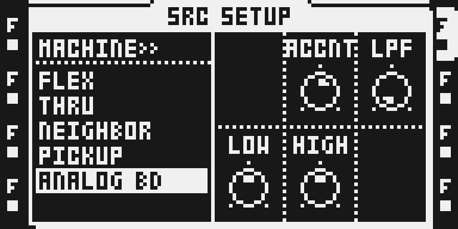
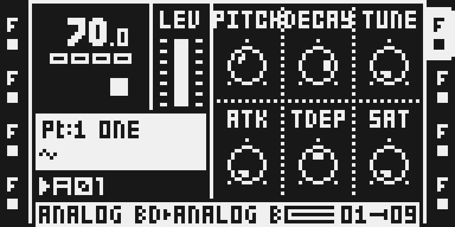
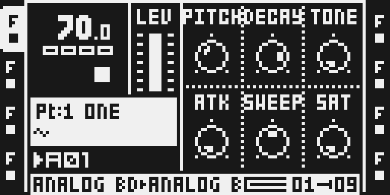

# Analog BD

Version `0.1.4-experimental` fits the 909 body, Attack and Tune more closely to Skee Mask's private TR-909 direct-out recordings. The 808 engine and existing TDEP/SAT smoothing remain unchanged. The owner approved the sound and explicitly waived fresh physical hardware/persistence testing, worst-case chip timing and complete memory bounds for this exact experimental source.

## Overview

Analog BD synthesizes 808 and 909 bassdrums inside the Octatrack DSP. The 909 update fits harmonic phase/asymmetry as well as magnitude, and refines the complete hit's envelope/DC response. Minimum and maximum Attack are fitted together with both fast onset and longer discharge following the knob. Tune uses the final recorded hits for its high endpoint, including a small settled-pitch difference; the sweep is not treated as evenly spaced knob positions.

Pulse strength and shaped noise vary subtly between consecutive hits. Timing and pitch receive no random variation. The model's transient shapes remain more consistent than the recording, so individual-hit reproduction is approximate. The reference instrument has a decay modification and was recorded with decay a little above halfway; its full modified decay range is not reproduced.

Existing 0.1.3 smoothing is retained: 909 TDEP excursion/thump and both models' SAT position slew by 1/64 of the remaining difference per sample, about 1.44 ms at 44.1 kHz. SAT drive, makeup and coupling interpolate along that common position. First use seeds the patch directly and retriggers retain smoothing history. No new saved parameter is added.

## Controls

All ranges are 0–127. Assignment defaults and stored control bytes remain unchanged.

| Control | Assignment default | Behavior |
| --- | --- | --- |
| PITCH | 64 | Body pitch; 909 spans approximately 30–100 Hz. |
| DECAY | 80 | Original body-decay law for each model. |
| TONE / TUNE | 80 | 808 transient tone / 909 pitch-envelope duration and fitted endpoint excursion, with a small settled-pitch difference. |
| ATK | 64 | 808 transient control; 909 fast/long pulse strength with a retained minimum transient. |
| SWEEP / TDEP | 64 | Original 808 sweep; smoothed 909 pitch excursion and associated thump. |
| SAT | 0 | Shared desk drive with smoothed table interpolation. |
| ACCNT | 64 | Accent in SRC SETUP. Loud combinations can reach the existing output limiter. |
| LPF | 127 | Bypass at 0; existing nominal network at 64; 18 kHz at the assignment default. Use 0 for comparison with the direct-out recording. |
| LOW / HIGH | 64 / 64 | Shared desk bands; 64 is neutral. High LOW/ACCNT can limit. |

The former MODEL knob and final SRC SETUP encoder stay inactive. Choose 808 or 909 in the engine browser. AMP and both FX pages retain their existing behavior.

## Usage

Use separate Attack and Tune sweeps so their effects are easy to hear. For the direct-out reference, bypass LPF; then adjust it separately for your own sound. Saved patches retain their control bytes but 909 timbre changes with this version. Keep a separate project copy for stock firmware.

### Compare the 909 direct-out response

1. In a disposable project, hold FUNC and press SRC for SRC SETUP, choose ANALOG BD and press YES. Double-tap the TRACK key, choose 909 and confirm with YES. Set LOW/HIGH to 64 and SAT to 0.
2. For the direct-out reference, set PITCH 49, DECAY 100, TUNE 0, TDEP 64, ACCNT 72 and LPF 0. Trigger repeated hits at 70 BPM and sweep ATK alone through 0–127, then hold it at one value to hear the small strength/noise differences.
3. Hold ATK at 0 and sweep TUNE through its endpoints separately. Return SAT to 0 and TDEP to 64, then press STOP and let the tail finish. Choose 808 in the engine browser to compare; its saved knob values remain intact.

### Switch back to Flex

Changing an Analog BD track to FLEX retains its SRC parameter values. Analog BD uses the track's Flex parameter slots, so drum settings become sample-playback settings such as STRT, RTRG and RTIM. Existing trigs can therefore produce a short, weak or unexpectedly pitched sample until those settings are adjusted. The [reporter of issue #363](https://github.com/repeat98/modwerk/issues/363) confirmed that clearing SRC restored normal Flex playback and withdrew the bug claim.

1. Select FLEX in the track machine chooser or SRC SETUP, then select the sample you want to play.
2. Press SRC, hold SRC and press PLAY to initialize the SRC parameter page to the Flex defaults. This replaces the current SRC settings; repeat SRC + PLAY immediately to undo. Check SRC SETUP and the sample assignment afterwards.
3. Play the pattern again. If particular trigs still sound different, review their SRC parameter locks, scene assignments and LFO destinations: they may still target the same parameter slots. Adjust those deliberately for the sample.

The page-clear shortcut is documented in the [Octatrack MKII manual, section 12.9.8](https://www.elektron.se/wp-content/uploads/2024/09/Octatrack-MKII-User-Manual_ENG_OS1.40A_210414.pdf#page=73). This guidance records the reporter's recovery and the current switch code; it adds no new physical hardware qualification.

## Compatibility and limitations

The target remains Octatrack 1.40C with the existing Analog BD registration and SPRING REV reservation. SYNTH, MACHINEDRUM and POLY registration conflicts remain unchanged. Existing stock-firmware project-clamping limitations still apply.

The supplied 909 recordings cover one modified instrument and one decay setting. Intermediate physical knob positions are unknown. Body/Attack/Tune agreement is closer, not a 1:1 recreation of every setting or every hit. Current-source physical audio, Part/project/reboot persistence, maximum FX load, chip timing and complete lifetime/stack memory bounds remain unverified. Earlier 0.1.3 MKII reports remain historical. The owner approved this exact release with those named qualification limits; no hardware pass is inferred.

## Tests and measurements

[TESTING.md](TESTING.md) binds the native/emulator results and owner exception to this source. All 128 values of ten audible controls, trigger splits, both-core code placements and four distinct interleaved voices/core pass focused native gates. Actual complete-image source/stock AMP/main-output checks pass at the three reference endpoints; the saved private update round-trips to the tested MAIN OS. These are software checks.

Matched 909 executed instruction cost rises 6.22% on average and 6.27% in the most increased matched block versus 0.1.3. 808 output/counts remain unchanged. Combined code is 997 P words/core plus the separate 35-word helper, within the existing reservation; X upload, voice blocks, Y and ColdFire allocations remain unchanged. These counts are not chip wall-clock timing or maximum-load headroom. See [CPU.md](CPU.md).

## Authorship and licences

Original 808/909 engines and integration: repeat98 (Jannik Aßfalg). Composition infrastructure: Sam Banks. Existing tooling/author notices and MIT terms remain in [LICENSE](LICENSE); the approved upstream import remains pinned to `sambanks/octabam` commit `363861e31ee963c478fab2b190a0fabe1d7ce37b`.

Many thanks to **Skee Mask**, who kindly recorded his TR-909 so we could match Analog BD more closely. The reference recordings remain private and are not distributed or covered by the source-code licence. The fitting and source changes retain the existing MIT terms. No firmware, extracted stock code or private project is included.

## Screens and audio

These are actual MKII controller-emulator LCD pixels from the current AB014REF05 image, with the real DSP enabled and transport stopped. [Capture provenance](media/capture.json) records the image, tool and disposable project. UI captures demonstrate controls and access; they do not prove physical audio or persistence. The owner auditioned actual firmware-emulator audio separately.

Hold FUNC and press SRC for SRC SETUP. ANALOG BD is assigned; LOW/HIGH 64 provide a neutral desk starting point. Use LPF 0 when comparing the direct-out reference, then adjust filtering separately.

Double-tap the assigned TRACK key to open the engine browser. Choose 909 with UP/DOWN or LEVEL and press YES. NO closes the browser without changing the engine.

Press SRC for 909 PITCH, DECAY, TUNE, ATK, TDEP and SAT. Try Attack alone with Tune fixed, then a separate Tune sweep; finish with STOP and let the tail decay.

Choose 808 in the same browser to compare its retained engine. E is labelled SWEEP in place of TDEP. The third encoder controls 808 TONE, although the shared page reads TUNE in this capture; switching retains control bytes.

